## Introduction
This project focuses on creating an application for managing allotment gardens. The backend repository can be found [here](https://github.com/Jakub-Roszkowski/rod-manager). Please follow the instructions provided in its README to set up and run the backend.

## Collaboration
- The frontend of the project was developed by a two-person team, primarily focusing on the user interface.
- Collaborate with the backend team from the [backend repository](https://github.com/Jakub-Roszkowski/rod-manager) for integration with the application.
- Regularly update project documentation collaboratively within the team.

## Contributors
- Jakub Roszkowski (Frontend Developer)
- Kamil Nowak (Frontend Developer)

## Screenshots
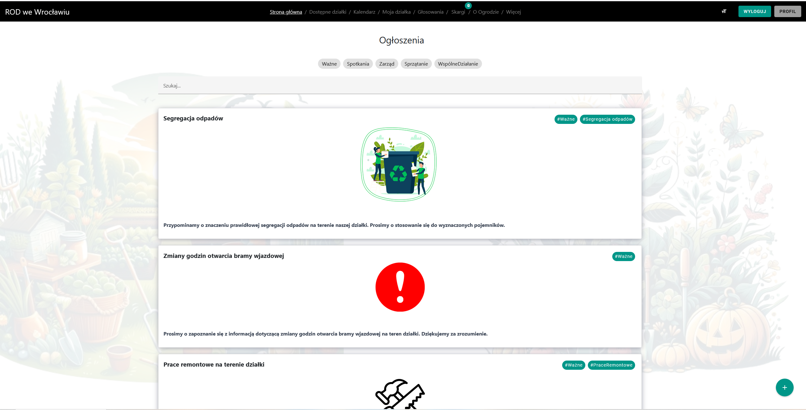
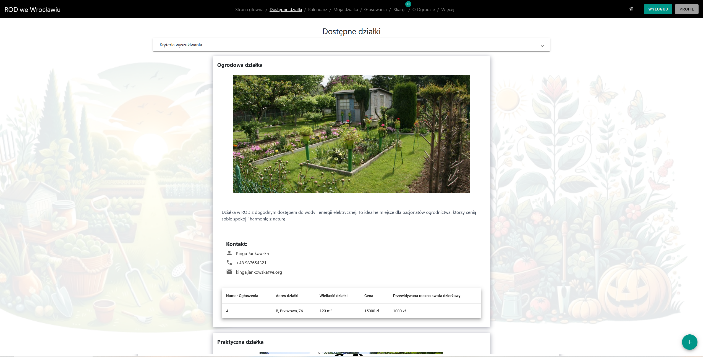
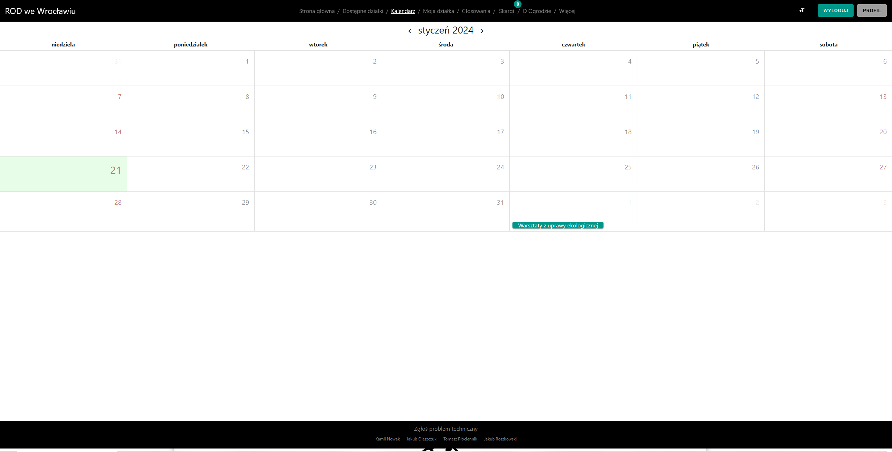
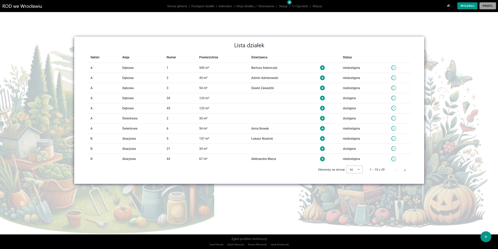
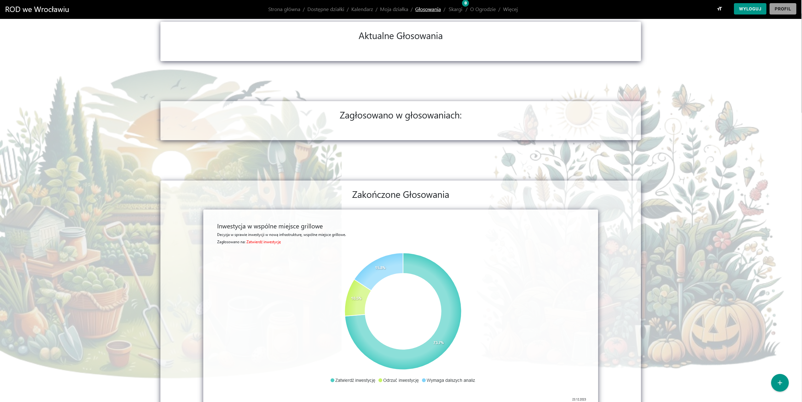
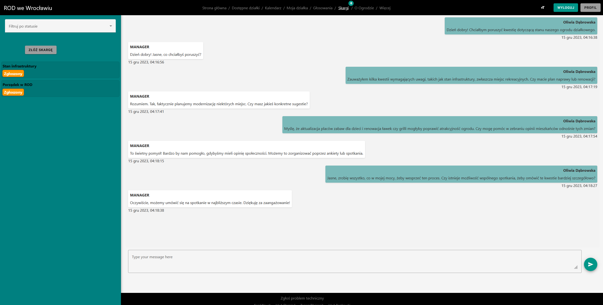
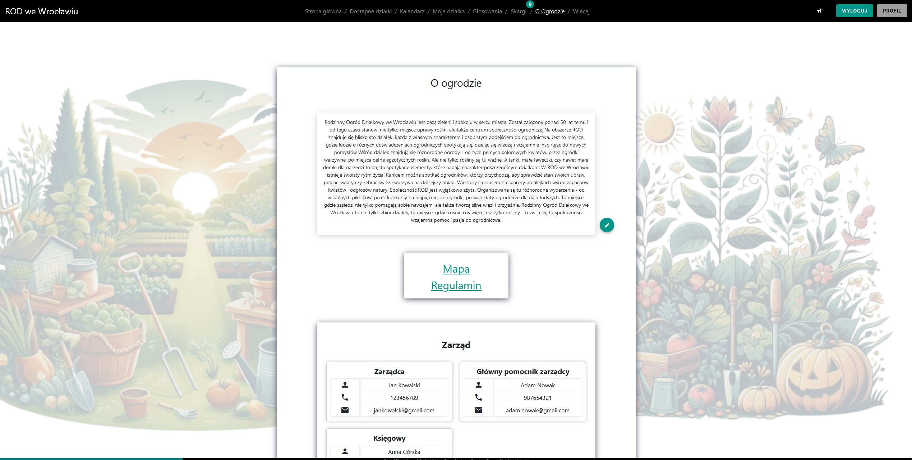
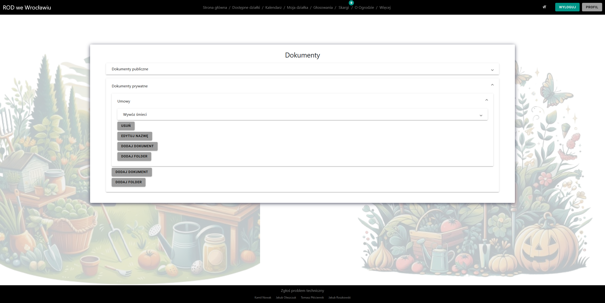

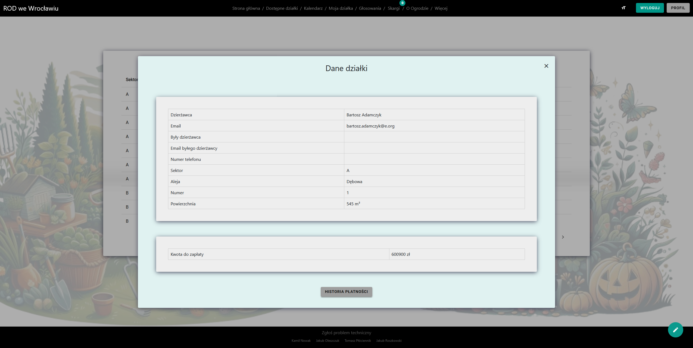
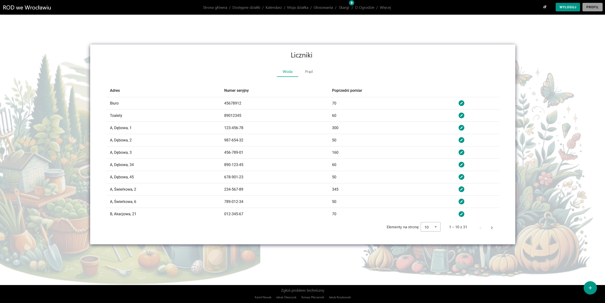
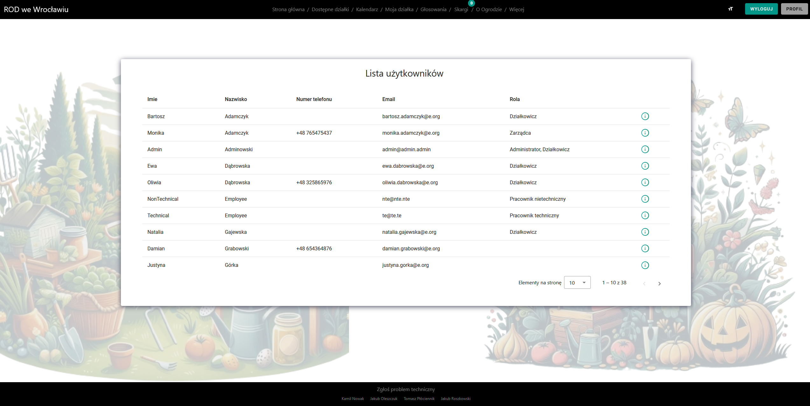
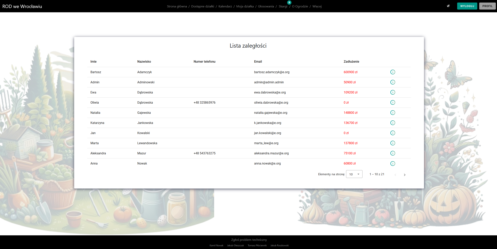
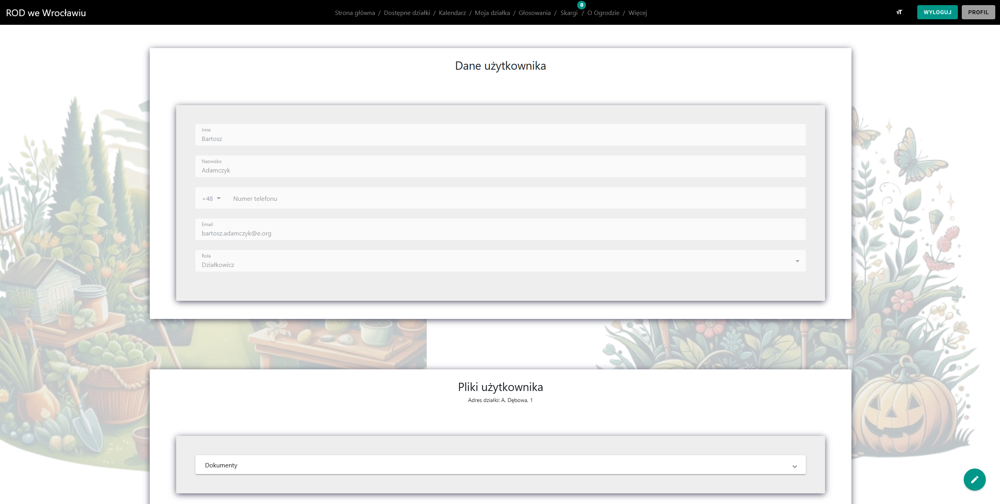

Thank you for your interest in our project! If you have any questions, feel free to use the "Issues" tab or contact us by email.
